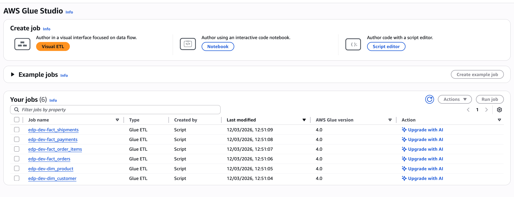
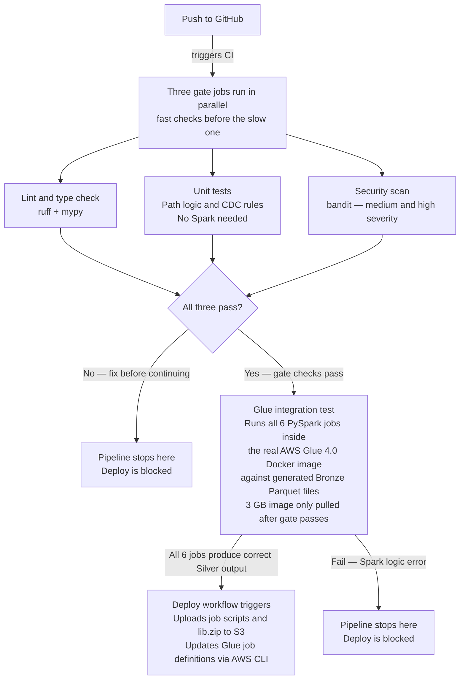

# platform-glue-jobs

This repository is part of the [Enterprise Data Platform](https://github.com/enterprise-data-platform-emeka/platform-docs). For the full project overview, architecture diagram, and build order, start there.

**Previous:** [platform-cdc-simulator](https://github.com/enterprise-data-platform-emeka/platform-cdc-simulator): the simulator generates the PostgreSQL OLTP traffic that DMS captures and lands in the Bronze S3 layer as Parquet CDC files that these jobs read.

---

## What this repository does

These are the six AWS Glue PySpark jobs that transform raw CDC (Change Data Capture) data from the Bronze S3 (Simple Storage Service) layer into the clean Silver star schema.

The core challenge is CDC reconciliation. AWS DMS (Database Migration Service) writes every database change as a separate file: one file for an insert, another for the update, another for the delete. A single order record can appear dozens of times across Bronze as it moves through status transitions. Each job here resolves all those operations into a single current-state row per entity, validates it, and routes it to Silver or Quarantine.

---

## How Bronze data arrives

DMS writes Parquet files to S3 in two forms. On first load it writes a single full-load file containing every existing row. After that it writes CDC files, one per batch of changes, partitioned by date. Each record has three extra columns DMS adds:

- `Op`: the operation type: `I` for insert, `U` for update, `D` for delete
- `_dms_timestamp`: when DMS captured the change
- `_dms_operation`: same as Op, written in full

The jobs read both the full-load file and all CDC files together, sort by `_dms_timestamp`, and keep only the latest row per primary key. Deletes (Op = `D`) are filtered out. The result is identical to running `SELECT * FROM the_source_table` at the time the job runs.

---

## The six jobs

| Job | Source tables | Output table | Partition columns |
|---|---|---|---|
| `dim_customer.py` | customers | `dim_customer` | None |
| `dim_product.py` | products | `dim_product` | None |
| `fact_orders.py` | orders | `fact_orders` | `order_year`, `order_month` |
| `fact_order_items.py` | order_items | `fact_order_items` | `order_year`, `order_month` |
| `fact_payments.py` | payments | `fact_payments` | `payment_year`, `payment_month` |
| `fact_shipments.py` | shipments | `fact_shipments` | `shipped_year`, `shipped_month` |

Dimension tables are not partitioned because they are small and always read in full. Fact tables partition by year and month so Athena can skip irrelevant partitions when queries filter by date.

---

## Shared library (`lib/`)

All six jobs share a library rather than duplicating logic.

**`lib/cdc.py`**: CDC reconciliation. Uses Spark window functions to sort all rows for each primary key by `_dms_timestamp` descending, keeps the first (latest) row, and drops rows where `Op = D`. This is the core logic that turns a stream of change events into a current-state snapshot.

**`lib/schemas.py`**: Explicit PySpark StructType definitions for every Bronze table. DMS writes Parquet with its own type inference, which sometimes produces unexpected types. Defining schemas explicitly ensures the jobs read Bronze with the correct types regardless of what DMS chose.

**`lib/validation.py`**: Data quality validation. Each job defines a list of SQL-style boolean rules (for example, `customer_id IS NOT NULL` or `unit_price > 0`). The validation library evaluates every rule against every row and splits the DataFrame into two: valid rows that pass all rules, and invalid rows that fail at least one. Invalid rows get a `_validation_errors` column listing which rules they failed, then go to the Quarantine bucket. Nothing is silently dropped.

**`lib/paths.py`**: Path resolution for Bronze, Silver, and Quarantine locations. Handles both `file://` paths for local Docker runs and `s3://` paths for AWS. The job code never has conditionals for local vs cloud: it just calls `paths.bronze()` and gets the right path for the environment.

**`lib/job_utils.py`**: Glue job lifecycle helpers. Initializes the Glue context and job, and commits the job bookmark on success. Handles the case where the Glue context is not available (local Docker run) without crashing.

**`lib/freshness.py`**: Data freshness metric publisher. Each job captures `max(_dms_timestamp)` from the Bronze DataFrame before `cdc.reconcile()` runs (reconcile drops that column from its output). It computes how many hours that timestamp sits behind a fixed reference date of `2026-03-02 23:59:59 UTC` — the latest date present in the Bronze dataset — and publishes that value as a custom CloudWatch metric called `SilverDataAgeHours` in the `EDP/DataFreshness` namespace. A value near zero means the data reached the expected cutoff. A large positive value means the data is stale relative to the cutoff. The publish call is wrapped in `try/except` so local Docker runs are unaffected when no AWS credentials are present.

---

## Validation and quarantine

Every job applies validation rules specific to its table. A customer record fails if `customer_id` is null or empty. An order record fails if `order_status` is not one of the known valid states. A payment record fails if `amount` is negative.

Valid records go to Silver. Invalid records go to Quarantine with a `_validation_errors` column. This means data quality problems are visible and fixable: you can query Quarantine to see exactly which records failed and why, fix the upstream issue, and re-run the job.

The Quarantine bucket is in a separate S3 location from Silver so invalid data can never accidentally be queried as if it were clean.

---

## Repository structure

```
platform-glue-jobs/
├── jobs/
│   ├── dim_customer.py
│   ├── dim_product.py
│   ├── fact_orders.py
│   ├── fact_order_items.py
│   ├── fact_payments.py
│   └── fact_shipments.py
├── lib/
│   ├── cdc.py
│   ├── schemas.py
│   ├── validation.py
│   ├── paths.py
│   ├── job_utils.py
│   └── freshness.py         ← CloudWatch data freshness metric publisher
├── scripts/
│   └── generate_bronze.py     ← generates test Bronze Parquet files locally
├── tests/
│   ├── conftest.py
│   ├── test_cdc.py
│   ├── test_validation.py
│   └── test_schemas.py
├── docker-compose.yml         ← AWS Glue 4.0 Docker image + Spark History Server
├── Makefile
├── pyproject.toml
└── requirements.txt
```

---

## Running locally

Local runs use the official AWS Glue 4.0 Docker image, which contains the exact same Spark version as AWS. Jobs run against local Parquet files instead of S3.

**Prerequisites:** Docker Desktop, pyenv, Python 3.11.8.

```bash
# First time setup
make setup

# Generate test Bronze data
make bronze

# Run a job locally (reads from data/bronze/, writes to data/silver/)
make run JOB=dim_customer
make run JOB=fact_orders

# Run all jobs
make run-all

# Run tests
make test

# Lint and type check
make lint
make typecheck
```

---

## Running against AWS

Jobs are deployed to AWS Glue as Glue jobs with the script uploaded to S3.

 The MWAA (Amazon Managed Workflows for Apache Airflow) DAG triggers them on schedule. You can also trigger a job manually:

```bash
# Deploy all job scripts to S3
make deploy ENV=dev

# Trigger a specific job in AWS
make run-aws JOB=dim_customer ENV=dev

# Watch the job run status
make status JOB=dim_customer ENV=dev
```

The jobs read from the Bronze bucket and write to the Silver bucket. Both bucket names and paths are passed as Glue job parameters, so the same script runs in dev, staging, and prod without code changes.

---

## Data freshness monitoring

Each Silver job publishes a custom CloudWatch metric after it finishes writing. The metric answers: "How close to the expected data cutoff did this job get?"

The reference date is `2026-03-02 23:59:59 UTC`, the latest date present in the Bronze dataset. Before CDC reconciliation runs (which drops `_dms_timestamp`), each job captures `max(_dms_timestamp)` from the raw Bronze DataFrame. It then computes:

```
age_hours = (reference_date - max_dms_timestamp) / 3600
```

A value of zero means the data reached exactly the reference cutoff. A value of 10 means the latest Bronze record arrived 10 hours before the reference. A value above 24 triggers the CloudWatch alarm `edp-dev-silver-{table}-stale` (defined in the `monitoring` Terraform module).

| Metric | Namespace | Dimensions |
|---|---|---|
| `SilverDataAgeHours` | `EDP/DataFreshness` | `Table`, `Environment` |

The metric is published via boto3. In local Docker runs the publish is skipped silently because no AWS credentials are present. The Glue IAM role has `cloudwatch:PutMetricData` scoped to the `EDP/DataFreshness` namespace.

---

## Output format

All Silver tables are written as Parquet with Snappy compression. Fact tables are partitioned by year and month using integer columns (not strings) so Athena sorts partitions correctly. The Glue Crawler that runs after the jobs updates the Glue Catalog so Athena always has the latest schema.

---

## Tests

Tests use pytest and run against locally generated Parquet files. No AWS credentials are needed. The test suite covers CDC reconciliation edge cases (multiple updates for the same key, mixed insert/update/delete sequences), validation rule evaluation, schema enforcement, and path resolution.

**Unit tests** check the logic around the Spark jobs: path resolution, CDC reconciliation rules, and validation logic. These are plain Python functions that run in milliseconds with no Spark cluster.

**Integration tests** run the actual PySpark scripts inside the official AWS Glue 4.0 Docker image, the exact same runtime used in production. There is no cluster: the Docker image includes a local Spark session. The test generates small Bronze Parquet files in memory, runs each job, and checks the Silver output matches what is expected.

There are no CSV fixture files because CSV doesn't preserve Parquet column types cleanly. Generating Parquet directly means the test data always matches the exact schema the jobs expect.

```bash
make test           # run all tests
make test-coverage  # run tests with coverage report
```



The integration job pulls a 3 GB Docker image so it only runs after the gate jobs pass. There is no point pulling a large image if a simple lint error would have caught the problem.

---

## CI/CD

CI skips runs triggered by README or fixture data changes. Only source code changes (`jobs/`, `lib/`, `scripts/`, `tests/`, config files) trigger the pipeline.

### On every pull request and push to main

Three gate jobs run in parallel:

| Job | What it checks |
|---|---|
| Lint and type check | ruff (style) + mypy (types) on `scripts/` |
| Unit tests | pytest unit tests with coverage report |
| Security scan | bandit scans `jobs/`, `lib/`, `scripts/` for MEDIUM and HIGH severity issues |

If all three pass, a fourth job runs:

| Job | What it checks |
|---|---|
| Glue integration | Runs all six Silver PySpark jobs inside the real AWS Glue 4.0 Docker image against locally generated Bronze Parquet files |

The integration job is the only one that proves the Spark logic works end-to-end. It only starts once the gate jobs pass so the 3 GB Glue image is not pulled on a lint failure.

### On merge to main

The deploy workflow triggers automatically after CI completes successfully. It uploads all six `jobs/*.py` scripts and `lib.zip` to the S3 (Simple Storage Service) Glue scripts bucket in dev, then creates or updates the Glue job definitions via the AWS CLI. Authentication uses OIDC (OpenID Connect), no long-lived AWS credentials are stored anywhere.

### Promotion to staging and prod

Trigger the Deploy workflow manually from GitHub Actions, choose the target environment. GitHub Environment protection rules require reviewer approval for staging and prod before the job runs.

---

**Next:** [platform-dbt-analytics](https://github.com/enterprise-data-platform-emeka/platform-dbt-analytics): with Silver tables populated, dbt SQL models aggregate them into the Gold business tables (revenue trends, product performance, customer acquisition, and more) that power the analytics agent.
